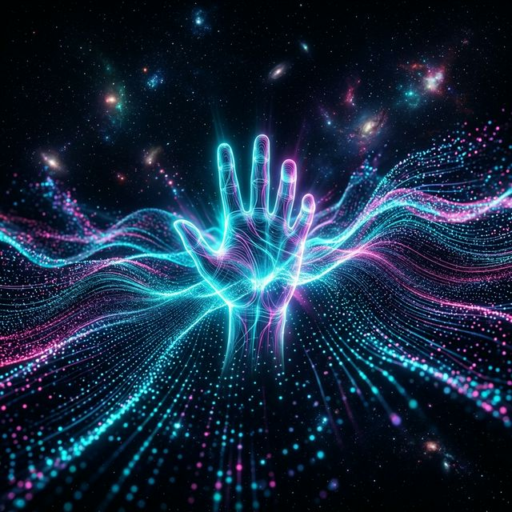
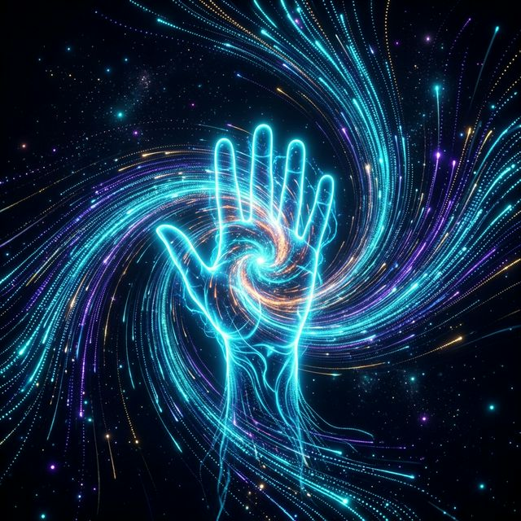
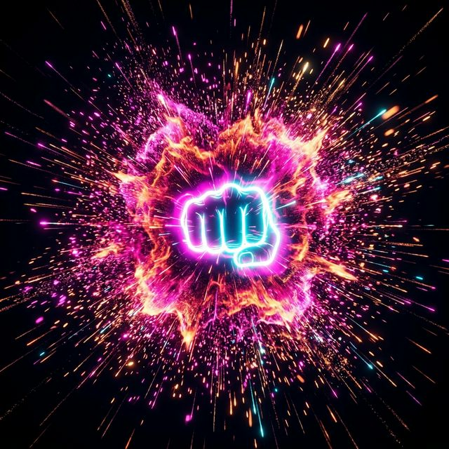
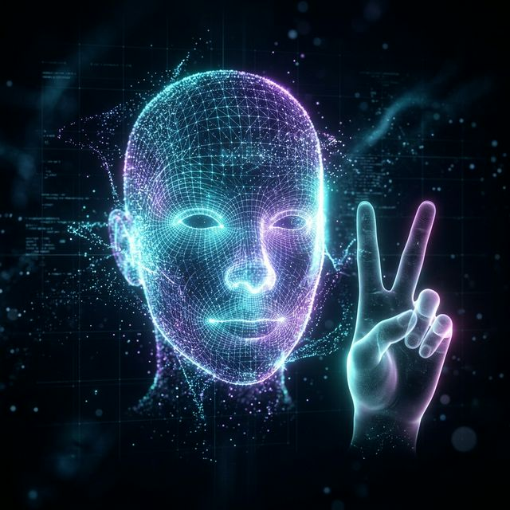

# HandGravity 🌌

**Transform your webcam into a physical interaction field with high-energy neon particles.**

---

HandGravity is a premium, real-time holographic particle system controlled entirely by hand gestures. Powered by **MediaPipe Holistic** and **HTML5 Canvas**, it transforms your webcam into a physical interaction field where thousands of neon particles react to your movements with fluid, high-energy physics.

The centerpiece of the experience is the **FaceMatrix Hologram**, a feature that maps the entire particle field into a real-time 3D tracking of your face.

---

## 🎨 Visual Gallery (Concept Art)

| **ATTRACT** | **REPEL** | **FACEMATRIX** |
| :---: | :---: | :---: |
|  |  |  |
| *Particles swirling into a gravitational palm vortex.* | *A high-velocity kinetic blast shattering the field.* | *Thousands of particles mapping a 3D facial mesh.* |

---

## ✨ Key Features

- **🧬 FaceMatrix Hologram Mapping**: Snap 15,000 particles into a 468-point 3D mesh of your face in real-time.
- **✋ Gesture-Driven Physics**: Five distinct interaction states (Attract, Repel, Grab, Swirl, and Peace).
- **🚀 High-Performance Rendering**: Sustained 60 FPS performance using optimized 2D Canvas loops and physics vector math.
- **🎨 Customizable Aesthetics**: Choose between *Cyberpunk*, *Magma*, and *Deep Ocean* themes.
- **🛠️ Persistent UI Settings**: Modern glassmorphism navbar and context menus that save your preferences to `localStorage`.
- **🎥 Dynamic Webcam UI**: Right-click the webcam preview to resize and reposition it to any corner.

---

> [!IMPORTANT]
> **Privacy Note**: All hand and face tracking is processed **locally** in your browser via WASM. No video data is ever sent to a server.

---

## 🎮 Interaction Guide

| Gesture | Interaction | Technical Rule |
| :--- | :--- | :--- |
| **Peace Sign** | `FaceMatrix` | **HOLOGRAPHIC MODE**: Particles snap into a 3D face mesh. |
| **Open Palm** | `ATTRACT` | Particles move toward your palm center via gravitational pull. |
| **Fist** | `REPEL` | **EXPLOSION**: A high-velocity kinetic blast pushes particles away. |
| **Pinch** | `GRAB` | **STILLNESS**: Particles stick to your fingertips for precision control. |
| **Two Hands** | `SWIRL` | **VORTEX**: Creates a whirlpool between your two active palms. |
| **No Hand** | `DRIFT` | **GRAVITY**: Particles drift slowly downward with low friction. |

---

## 🛠️ Getting Started (After Cloning)

Setting up HandGravity locally is designed to be **instant and dependency-free**. 

### 1. Prerequisites
- **Webcam**: Essential for interaction.
- **Chrome/Edge**: Optimized for MediaPipe WASM acceleration.

### 2. Step-by-Step Installation
1. **Open the Project Folder**: `cd HandGravity`
2. **Serve the Project**: Use **VS Code Live Server**, Python (`python -m http.server 8000`), or Node (`npx http-server .`).
3. **Launch & Permissions**: Navigate to `http://localhost:8000`, click **Allow** camera access, and wait for initialization.

---

## 🏗️ Technical Architecture & Optimization

> [!TIP]
> **Performance Tip**: If the FPS drops below 60, try reducing the particle density in the Settings menu toggle.

HandGravity is built for speed. It uses **MediaPipe Holistic** to extract simultaneous hand and face data at 30+ updates per second.

- **`tracking.js`**: Orchestrates the Holistic pipeline and mirrors coordinates for a natural feel.
- **`gestures.js`**: Analyzes 21 landmarks per hand to classify states with sub-millisecond latency.
- **`particles.js`**: Custom physics engine using **Newtonian Gravity** ($g = 0.06$) and **Verlet Integration** (simulated via velocity vectors) to handle 15,000+ objects.
- **`renderer.js`**: Uses a **Trail-Fade technique** (clearing with `rgba(0,0,0,0.15)`) to create the glowing neon motion-blur effect without the overhead of heavy filters.

---

## 🔮 Future Roadmap
- [ ] **Sonic Gravity**: Web Audio API integration for motion-synth textures.
- [ ] **Chromatic Aberration**: Post-processing on high-energy blasts.
- [ ] **Custom Palettes**: Hexadecimal color theme selection.

Optimized for Chromium-based browsers. Created with ❤️ for interactive art. 🌌
